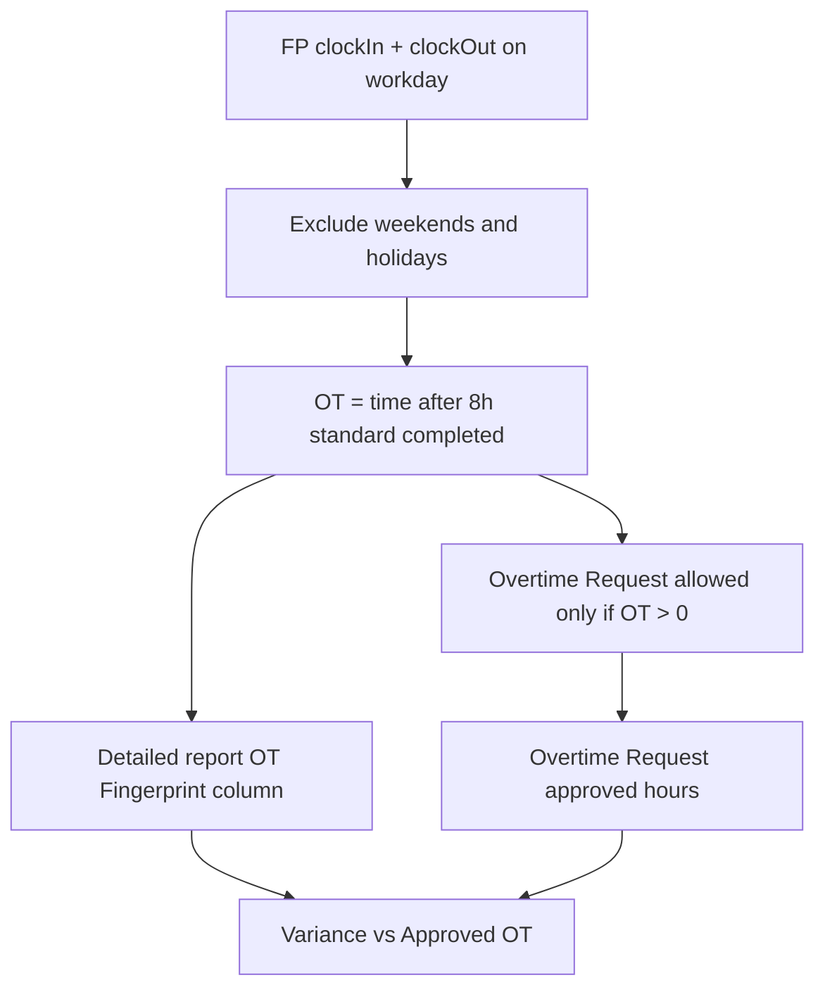

# Fix 8-Hour OT Calculation, Overtime Request & Remove Excuse Forms

## Part A — OT Report & Overtime Request (fingerprint + forms)

### Root Cause (why April/May shows nothing)

1. **Report is form-only** — [`routes/attendance.js`](routes/attendance.js) `GET /ot-reconciliation` only lists HR-approved `extra_hours` forms. Fingerprint data alone never appears.
2. **Wrong Actual OT math** — [`utils/attendanceParser.js`](utils/attendanceParser.js) uses **time after schedule end** (default 19:00), not **hours beyond 8h**.

### Naming — "Overtime Request"

Rename all employee/manager/admin-facing labels from **"Overtime Hours Report"** / **"Overtime Hours"** to **"Overtime Request"**.

| Location | Change |
|----------|--------|
| [`en.json`](hr-erp-frontend/src/locales/en.json) / [`ar.json`](hr-erp-frontend/src/locales/ar.json) | `extraHoursRequestOption`, `extra_hours`, section titles, help text, empty-state hints |
| [`FormSubmission.js`](hr-erp-frontend/src/components/FormSubmission.js) | Dropdown option, section headings |
| [`EmployeeDashboard.js`](hr-erp-frontend/src/components/EmployeeDashboard.js), [`ManagerDashboard.js`](hr-erp-frontend/src/components/ManagerDashboard.js), [`AdminDashboard.js`](hr-erp-frontend/src/components/AdminDashboard.js), [`SuperAdminDashboard.js`](hr-erp-frontend/src/components/SuperAdminDashboard.js) | Card labels ("Overtime Hours" → "Overtime Request") |

**Internal code** keeps `type: 'extra_hours'` in DB/API (no data migration).

---

### Working-hours & fingerprint rules (all three apply)



1. **Workday only** — OT fingerprint calculated only on regular working days. Use existing [`isWeekend()`](utils/attendanceParser.js) and [`isHolidayDateKey()`](utils/attendanceHolidays.js). Weekends/holidays → OT fingerprint = 0.
2. **8h standard, OT = time after 8h** — On a workday with valid punches:
   ```
   punch_duration = clockOut - clockIn
   OT_Fingerprint = max(0, punch_duration - 8 hours)
   ```
   This is literally the hours **after** completing the 8-hour standard (9th hour onward).
3. **Overtime Request gated on FP** — Employee **cannot submit** an Overtime Request for a date unless:
   - Attendance record exists for that user + date with `clockIn` and `clockOut`
   - Date is a workday (not weekend/holiday)
   - `OT_Fingerprint > 0` from punches

Backend enforcement in [`routes/forms.js`](routes/forms.js) POST `extra_hours` (frontend shows matching error message).

Optional UX: on date pick in [`FormSubmission.js`](hr-erp-frontend/src/components/FormSubmission.js), call a lightweight check endpoint or reuse attendance API to warn before submit.

---

### Detailed Report — dual data sources

| Source | Column |
|--------|--------|
| **Fingerprint (workday, >8h)** | **OT Fingerprint** |
| **Overtime Request (HR-approved)** | **Approved OT** |

| Column | Source |
|--------|--------|
| Employee Code | `user.employeeCode` |
| Employee Name | `user.name` |
| Department | `user.department` |
| OT Date | attendance date / `extraHoursDate` |
| OT Fingerprint | workday 8h rule from FP punches |
| Approved OT | matched form `approvedHours` (0 if no form) |
| Variance | Fingerprint − Approved (green/red) |

**Row inclusion (Detailed):**
- Workdays where **fingerprint OT > 0**, OR
- HR-approved Overtime Request on that date (fingerprint may be 0 for legacy rows only; new submissions cannot exist without FP OT)

**Final OT Report:** Employee Code, Name, Department, Final OT Hrs = `min(Fingerprint, Approved)` — **only where Approved OT > 0**.

---

### Phase A1 — Workday-aware 8h OT calculator

Add to [`utils/otReconciliation.js`](utils/otReconciliation.js):

```js
const STANDARD_WORK_MINUTES = 480;

function isOvertimeEligibleWorkday(date) {
  if (isWeekend(date) || isHolidayDateKey(dateKey)) return false;
  return true;
}

function calculateFingerprintOtMinutes(clockIn, clockOut, date) {
  if (!isOvertimeEligibleWorkday(date)) return 0;
  const duration = punchDurationMinutes(clockIn, clockOut);
  if (duration == null || duration <= STANDARD_WORK_MINUTES) return 0;
  return duration - STANDARD_WORK_MINUTES; // hours after 8h standard
}
```

Wire into [`utils/attendanceParser.js`](utils/attendanceParser.js), [`routes/attendance.js`](routes/attendance.js), [`routes/zkteco.js`](routes/zkteco.js), [`utils/attendanceDetailBuilder.js`](utils/attendanceDetailBuilder.js).

Add shared helper `getFingerprintOtForAttendance(attendanceRecord)` used by report + form validation.

---

### Phase A2 — Recalculate April/May uploads

**`POST /api/attendance/recalc-overtime?startDate&endDate`** (admin/super_admin)

- Recompute `minutesOvertime` using workday + 8h rule
- Post-deploy: `startDate=2026-04-01&endDate=2026-05-31`

---

### Phase A3 — Overtime Request submission gate

In [`routes/forms.js`](routes/forms.js) when `type === 'extra_hours'`:

1. Load `Attendance` for `req.user.id` + `extraHoursDate`
2. If missing punches → `400: No fingerprint punches found for this date`
3. If not workday → `400: Overtime is only allowed on working days`
4. If `calculateFingerprintOtMinutes(...) === 0` → `400: Fingerprint data shows no overtime beyond 8 hours for this date`
5. Optionally cap `extraHoursWorked` at fingerprint OT hours (employee cannot claim more than FP shows)

---

### Phase A4 — Redesign `GET /ot-reconciliation`

Rewrite [`routes/attendance.js`](routes/attendance.js):

1. Attendance in range → fingerprint OT per workday (8h rule)
2. Approved `extra_hours` forms in range → index by user + date
3. Merge → Detailed rows; `reconcileOvertime()` per row
4. Final → rows with `approvedHours > 0`

---

### Phase A5 — Frontend

- [`OtReconciliationReports.js`](hr-erp-frontend/src/components/OtReconciliationReports.js) — Employee Code column, updated empty-state
- Rename labels to **Overtime Request** (locales + dashboards)
- [`FormSubmission.js`](hr-erp-frontend/src/components/FormSubmission.js) — help text: "Only available when fingerprint shows overtime beyond 8 hours on a working day"

---

## Part B — Remove Excuse Forms (hide completely)

**Policy:** Historical excuse records stay in MongoDB but are invisible — no UI, no API, no new submissions.

### Phase B1 — Block submissions & logic

[`routes/forms.js`](routes/forms.js): remove `excuse` from POST; strip approval/deduction logic.

### Phase B2 — Hide from frontend

Remove from `FormSubmission`, `EmployeeDashboard`, `ManagerDashboard`, `AdminDashboard`, `SuperAdminDashboard`, `ExportPrintButtons`, `AttendanceManagement`, form filter utils.

### Phase B3 — Hide from APIs

Unmount [`routes/excuse-hours.js`](routes/excuse-hours.js); add `type: { $ne: 'excuse' }` to form list queries.

### Phase B4 — Attendance

Remove excuse from `crossReferenceWithForms()` in [`routes/attendance.js`](routes/attendance.js) and [`routes/zkteco.js`](routes/zkteco.js).

### Phase B5 — Dormant user fields

Leave `excuseRequestsLeft` in schema; stop active reset/deduction logic.

---

## Verification Checklist

### Overtime Request & fingerprint

| Scenario | Expected |
|----------|----------|
| Workday 10:00–20:00 FP | OT Fingerprint = 2h; Overtime Request allowed |
| Workday 10:00–18:00 FP | OT = 0; request rejected |
| Saturday punch 10h | OT = 0; request rejected |
| Holiday punch 10h | OT = 0; request rejected |
| Request without FP data | 400 rejected |
| UI dropdown label | "Overtime Request" |

### OT report (Apr/May after recalc)

| Scenario | Expected |
|----------|----------|
| Workday FP OT > 0, no form | Detailed row; not in Final |
| Workday FP OT + approved form | Variance + Final row |
| April/May upload | Detailed populates on workdays > 8h |

### Excuse removal

| Check | Expected |
|-------|----------|
| Employee forms | No excuse option |
| POST excuse | 400 |
| Lists/APIs | No excuse visible |

---

## Files Summary

| Area | Key files |
|------|-----------|
| OT calc + gate | `utils/otReconciliation.js`, `utils/attendanceParser.js`, `routes/forms.js`, `routes/attendance.js` |
| Rename | `en.json`, `ar.json`, `FormSubmission.js`, dashboards |
| OT report UI | `OtReconciliationReports.js` |
| Excuse removal | `routes/forms.js`, dashboards, `server.js`, `routes/excuse-hours.js`, attendance cross-ref |

---

## Post-deploy steps

1. Deploy (`git pull`, `npm run build`, `pm2 restart`).
2. Recalc April/May: `POST /api/attendance/recalc-overtime?startDate=2026-04-01&endDate=2026-05-31`
3. OT report (Apr–May) — Detailed shows workday fingerprint OT.
4. Test Overtime Request — only succeeds when FP shows OT > 0 on a workday.
5. Confirm excuse removed and labels say **Overtime Request**.
