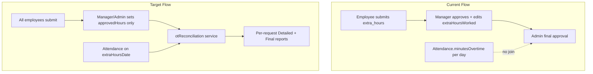
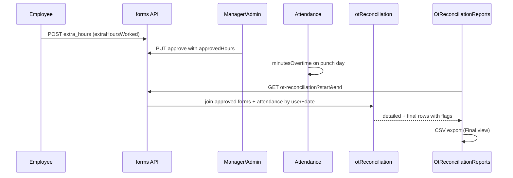

# OT Variance Reconciliation — Implementation Plan

## Current State

OT requests already exist as `Form` type `extra_hours` with fields `extraHoursDate`, `extraHoursWorked`, `extraHoursDescription`. They are **Marketing-only** today (enforced in both [FormSubmission.js](hr-erp-frontend/src/components/FormSubmission.js) and [routes/forms.js](routes/forms.js)). There is **no** `approvedHours` field; managers currently edit `extraHoursWorked` directly during approval in [ManagerDashboard.js](hr-erp-frontend/src/components/ManagerDashboard.js).

Biometric actual OT is stored as `Attendance.minutesOvertime`, computed in [utils/attendanceParser.js](utils/attendanceParser.js) as minutes worked past `workSchedule.endTime`.



---

## Phase 1 — RBAC: OT Requests for All Employees

### 1.1 Remove Marketing-only gate

| File | Change |
|------|--------|
| [hr-erp-frontend/src/components/FormSubmission.js](hr-erp-frontend/src/components/FormSubmission.js) | Show `extra_hours` option for **all** authenticated users (remove `department === 'Marketing'` guard on lines 347–349). Keep WFH Marketing-only unchanged. |
| [routes/forms.js](routes/forms.js) | Delete the Marketing department `403` block for `extra_hours` (lines 164–167). Keep field validation (date, hours, description). |

### 1.2 Add `approvedHours` field (manager/admin only)

| File | Change |
|------|--------|
| [models/Form.js](models/Form.js) | Add optional `approvedHours: Number` (required only when `type === 'extra_hours'` **and** `status` transitions to `manager_approved` or `approved`). |
| [routes/forms.js](routes/forms.js) | **Employee POST `/`**: never accept `approvedHours` from body. **Manager PUT `/manager/:id`** and **Admin PUT `/:id`**: accept `approvedHours` for `extra_hours` on approve; validate `> 0`. Stop overwriting employee claim via `extraHoursWorked` on approval—managers edit `approvedHours` instead. **Manager PUT `/manager/:id/edit`**: allow `approvedHours` only while form is `pending`. Strip `approvedHours` from any employee-scoped routes. |
| [hr-erp-frontend/src/components/ManagerDashboard.js](hr-erp-frontend/src/components/ManagerDashboard.js) | Replace approval/edit input for OT: show read-only **Requested Hours** (`extraHoursWorked`) and editable **Approved OT Hours** (`approvedHours`). Send `approvedHours` in approve/edit payloads. |
| [hr-erp-frontend/src/components/AdminDashboard.js](hr-erp-frontend/src/components/AdminDashboard.js) | Display both requested vs approved hours on `extra_hours` cards; allow admin to set/adjust `approvedHours` on final approval if not already set. |
| [hr-erp-frontend/src/components/EmployeeDashboard.js](hr-erp-frontend/src/components/EmployeeDashboard.js) | Show requested hours; show approved hours only after manager/admin approval (read-only). |
| [hr-erp-frontend/src/locales/en.json](hr-erp-frontend/src/locales/en.json) + [ar.json](hr-erp-frontend/src/locales/ar.json) | Add labels: `approvedOtHours`, `requestedOtHours`. |

**Backward compatibility:** existing approved forms without `approvedHours` fall back to `extraHoursWorked` in the reconciliation service.

---

## Phase 2 — Core Calculator (`otReconciliation` service)

### 2.1 New utility file

Create [utils/otReconciliation.js](utils/otReconciliation.js) with a pure, testable API:

```js
function reconcileOvertime(actualPunchingHours, approvedHours) {
  const actual = Number(actualPunchingHours) || 0;
  const approved = Number(approvedHours) || 0;
  const variance = actual - approved;
  const finalPayableHours = Math.min(actual, approved);
  let varianceFlag = 'neutral'; // actual === approved
  if (variance > 0) varianceFlag = 'positive'; // Green
  if (variance < 0) varianceFlag = 'negative'; // Red
  return { actualPunchingHours: actual, approvedHours: approved, variance, finalPayableHours, varianceFlag };
}
```

Also export a row builder for per-request reconciliation:

```js
function buildOtReconciliationRow({ form, attendanceRecord, user }) {
  const actualHours = (attendanceRecord?.minutesOvertime ?? 0) / 60;
  const approvedHours = form.approvedHours ?? form.extraHoursWorked ?? 0;
  const calc = reconcileOvertime(actualHours, approvedHours);
  return {
    formId: form._id,
    employeeCode: user.employeeCode,
    employeeName: user.name,
    department: user.department,
    otDate: form.extraHoursDate,
    requestedHours: form.extraHoursWorked,
    ...calc
  };
}
```

No DB access inside the pure functions—keeps the "brain" isolated and unit-testable.

### 2.2 New report API endpoint

Add to [routes/attendance.js](routes/attendance.js) (admin/super_admin only, matching existing report RBAC):

**`GET /api/attendance/ot-reconciliation?startDate&endDate`**

Query logic (per-request scope per your choice):
1. Fetch `Form` documents: `type: 'extra_hours'`, `status: 'approved'`, `extraHoursDate` within range. Populate `user` (`name`, `department`, `employeeCode`).
2. For each form, find matching `Attendance` where `user` = form.user and `date` = `extraHoursDate` (same calendar day).
3. Map each pair through `buildOtReconciliationRow`.
4. Return `{ detailed: rows, final: rows.map(r => ({ employeeCode, employeeName, department, otDate, finalPayableHours })) }`.

Register route in [server.js](server.js) is already covered via existing `/api/attendance` mount.

---

## Phase 3 — HR Admin UI + Export

### 3.1 New report component

Create [hr-erp-frontend/src/components/OtReconciliationReports.js](hr-erp-frontend/src/components/OtReconciliationReports.js):

- Reuse date-range picker pattern from [AttendanceManagement.js](hr-erp-frontend/src/components/AttendanceManagement.js) (`rangeStart` / `rangeEnd`).
- Fetch `GET /api/attendance/ot-reconciliation`.
- Two sub-views (tabs or toggle): **Detailed OT Report** and **Final OT Report**.

**Detailed OT Report columns** (Title/Location omitted per your decision):

| Column | Source |
|--------|--------|
| Employee Name | `employeeName` |
| Department | `department` |
| OT Date | `otDate` |
| OT (Fingerprint Actuals) | `actualPunchingHours` |
| Approved OT | `approvedHours` |
| Variance | `variance` — green text if `varianceFlag === 'positive'`, red if `'negative'`, default if neutral |

**Final OT Report columns:**

| Column | Source |
|--------|--------|
| Employee Code | `employeeCode` |
| Employee Name | `employeeName` |
| Department | `department` |
| OT Date | `otDate` |
| Final OT Hrs | `finalPayableHours` |

### 3.2 Wire into Admin dashboard

In [AdminDashboard.js](hr-erp-frontend/src/components/AdminDashboard.js), inside the existing Attendance tab panel (line ~2588), render `OtReconciliationReports` below or as a nested tab alongside `AttendanceManagement`—same admin-only section, no new top-level route needed.

Super Admin can reuse the same component in [SuperAdminDashboard.js](hr-erp-frontend/src/components/SuperAdminDashboard.js) if that dashboard also exposes attendance (optional, same pattern).

### 3.3 Export to Excel/CSV

Follow existing client-side CSV pattern from [ExportPrintButtons.js](hr-erp-frontend/src/components/ExportPrintButtons.js):

- Add **Export to Excel** button on the Final OT view only.
- Generate CSV via `Blob` download (`final_ot_report_YYYY-MM-DD.csv`).
- Columns: Employee Code, Employee Name, Department, OT Date, Final OT Hrs.
- No new frontend dependency required (CSV satisfies spec's ".xlsx or .csv" requirement). If `.xlsx` is preferred later, backend already has `xlsx` in [package.json](package.json).

### 3.4 i18n

Add keys to [en.json](hr-erp-frontend/src/locales/en.json) and [ar.json](hr-erp-frontend/src/locales/ar.json): report titles, column headers, export button label, empty-state messages.

---

## Data Flow (end-to-end)



---

## Files Touched (summary)

| Phase | New | Modified |
|-------|-----|----------|
| 1 | — | `Form.js`, `routes/forms.js`, `FormSubmission.js`, `ManagerDashboard.js`, `AdminDashboard.js`, `EmployeeDashboard.js`, `en.json`, `ar.json` |
| 2 | `utils/otReconciliation.js` | `routes/attendance.js` |
| 3 | `OtReconciliationReports.js` | `AdminDashboard.js`, `en.json`, `ar.json` |

---

## Testing Checklist

1. **RBAC:** Non-Marketing employee can submit `extra_hours`; cannot set `approvedHours` via API tampering.
2. **Approval:** Manager sets `approvedHours` independently of `extraHoursWorked`; admin final approval persists it.
3. **Calculator:** `reconcileOvertime(2, 1)` → variance `1`, flag `positive`, final `1`; `reconcileOvertime(1, 2)` → variance `-1`, flag `negative`, final `1`.
4. **Report join:** Approved OT form on date X pairs with that day's `minutesOvertime`; missing attendance → actual `0`.
5. **UI:** Variance colors render correctly; Final OT CSV downloads with correct columns.
6. **Regression:** WFH still Marketing-only; other form types unaffected.
