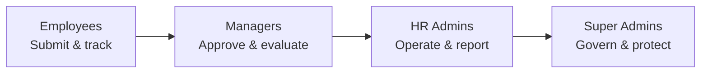
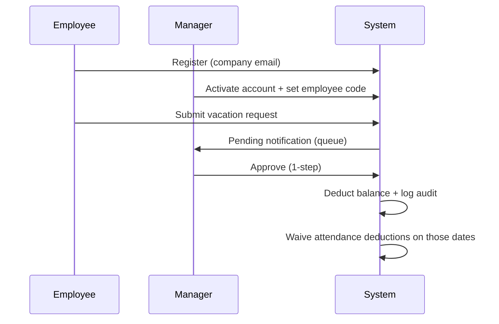

# HR ERP — Product Showcase

> **One platform. Every HR workflow.**  
> Built for **New Jersey Developments** — leave, attendance, recruitment, and governance in a single modern app.

---

## Where to find this documentation

| Document | Path | Best for |
|----------|------|----------|
| **This page (start here)** | [`APP_SHOWCASE.md`](./APP_SHOWCASE.md) | Executives, stakeholders, demos |
| **Module guides** | [`docs/showcase/`](./docs/showcase/) | Deep-dive per feature area |
| **Screenshot folder** | [`docs/showcase/assets/`](./docs/showcase/assets/) | Drop PNG/JPG captures here |
| **Screenshot guide** | [`docs/showcase/assets/README.md`](./docs/showcase/assets/README.md) | Which screens to capture |

### Module guides (click to open)

| # | Module | File |
|---|--------|------|
| 1 | Leave Management & Approvals | [`docs/showcase/01-leave-and-approvals.md`](./docs/showcase/01-leave-and-approvals.md) |
| 2 | Attendance & Time Tracking | [`docs/showcase/02-attendance.md`](./docs/showcase/02-attendance.md) |
| 3 | Recruitment (ATS) | [`docs/showcase/03-recruitment-ats.md`](./docs/showcase/03-recruitment-ats.md) |
| 4 | User Administration | [`docs/showcase/04-user-administration.md`](./docs/showcase/04-user-administration.md) |
| 5 | Reporting & Exports | [`docs/showcase/05-reporting.md`](./docs/showcase/05-reporting.md) |
| 6 | Governance (Audit, Backup, Settings) | [`docs/showcase/06-governance.md`](./docs/showcase/06-governance.md) |
| 7 | Roles, Security & Mobile | [`docs/showcase/07-roles-and-security.md`](./docs/showcase/07-roles-and-security.md) |
| 8 | Technical Reference | [`docs/showcase/08-technical-reference.md`](./docs/showcase/08-technical-reference.md) |

---

## Elevator pitch

HR ERP replaces spreadsheets, email chains, and disconnected fingerprint exports with **one system** that employees, managers, and HR actually use every day.

- Employees submit leave and see balances **instantly**
- Managers approve their team **in two clicks**
- HR gets a **ready-made pipeline** from request to payroll prep
- Biometric attendance **syncs automatically** from ZKTeco devices
- Candidates apply online; hiring stays **structured and auditable**
- Super admins sleep better with **encrypted daily backups** and a full audit trail

Available in **English and Arabic (RTL)**. Runs in the **browser** or as a **mobile app** (Capacitor).

---

## Hero screenshots

> Add your captures to `docs/showcase/assets/` — see the [asset guide](./docs/showcase/assets/README.md).

| Screen | Placeholder |
|--------|-------------|
| Login |  |
| Employee dashboard |  |
| Admin overview | *Add `06-admin-users.png` or capture admin Overview tab* |
| Public apply page |  |

*Images appear once you save screenshots with the filenames listed in the asset guide.*

---

## Who it's for



| Persona | What they gain |
|---------|----------------|
| **Employee** | Self-service leave, live balances, attendance snapshot, OT history |
| **Manager** | Team approvals, attendance visibility, ATS interviews, employee flags |
| **HR Admin** | User management, form pipeline, attendance upload, hiring dashboard, reports |
| **Super Admin** | Audit logs, encrypted backups, company policy settings, full override |

[Full role matrix →](./docs/showcase/07-roles-and-security.md)

---

## Feature highlights at a glance

### Leave & approvals
Two-step workflow (Manager → HR). Vacation, sick, WFH, overtime, missions. Automatic balance deduction. Half-day support.

→ [Read module guide](./docs/showcase/01-leave-and-approvals.md)

### Attendance intelligence
Excel import **or** live ZKTeco biometric push. 3-pillar fair deductions. OT reconciliation against approved forms.

→ [Read module guide](./docs/showcase/02-attendance.md)

### Hiring (ATS)
Public `/apply` page, CV auto-fill, two-stage evaluations, anti-spam protection.

→ [Read module guide](./docs/showcase/03-recruitment-ats.md)

### Administration
User lifecycle, department groups, bulk import, employee flags, insights dashboard.

→ [Read module guide](./docs/showcase/04-user-administration.md)

### Reports
OT reconciliation, deduction breakdown, detailed leaves, CSV/print exports — aligned to 25th pay period.

→ [Read module guide](./docs/showcase/05-reporting.md)

### Governance
40+ audit action types, daily encrypted backup, singleton system settings.

→ [Read module guide](./docs/showcase/06-governance.md)

---

## The employee journey (end to end)



[Full workflow details →](./docs/showcase/01-leave-and-approvals.md)

---

## Why organizations choose this over spreadsheets

| Pain today | HR ERP answer |
|------------|---------------|
| "Where is my request?" | Live status on employee dashboard |
| "Did they approve my OT?" | OT reconciliation: punches vs forms |
| "Who was late last month?" | One-click deduction report |
| "CVs in email threads" | Structured ATS with evaluations |
| "We lost HR data" | Daily encrypted backup + restore |
| "Who changed this balance?" | Full audit trail with old/new values |
| "English-only tools" | Arabic RTL built in |

---

## Platform capabilities

| Capability | Detail |
|------------|--------|
| **Languages** | English + Arabic (RTL) |
| **Themes** | Light / dark mode |
| **Mobile** | Capacitor Android shell (iOS-ready structure) |
| **Biometric** | ZKTeco ADMS real-time integration |
| **Security** | JWT, bcrypt, rate limiting, Helmet, encrypted backups |
| **Deployment** | PM2 + Nginx; Express serves React in production |

[Technical deep-dive →](./docs/showcase/08-technical-reference.md)

---

## Demo routes (live app)

| URL | Audience | Screen |
|-----|----------|--------|
| `/` | Everyone | Login & registration |
| `/employee` | Employees | Personal dashboard |
| `/manager` | Managers | Team & approvals |
| `/admin` | HR | Operations center |
| `/super-admin` | IT / super admin | Governance |
| `/apply` | Public | Job application (no login) |

---

## What's not included (by design)

- Payroll processing and payslips
- Benefits enrollment
- Annual performance reviews (ATS interview evals only)
- Excuse requests — **removed** from active UI (legacy data may exist in DB)

---

## Quick links for implementers

| Topic | Document |
|-------|----------|
| Deploy to production | [`README-DEPLOYMENT.md`](./README-DEPLOYMENT.md) |
| Biometric setup | [`BIOMETRIC_ATTENDANCE_IMPLEMENTATION.md`](./BIOMETRIC_ATTENDANCE_IMPLEMENTATION.md) |
| Backup system | [`BACKUP_SYSTEM.md`](./BACKUP_SYSTEM.md) |
| Email / password reset | [`EMAIL-SETUP.md`](./EMAIL-SETUP.md) |
| ATS feature list | [`ATS_FEATURES_SUMMARY.md`](./ATS_FEATURES_SUMMARY.md) |

---

## Documentation map

```
hrerp/
├── APP_SHOWCASE.md              ← YOU ARE HERE (sales / demo hub)
└── docs/
    └── showcase/
        ├── 01-leave-and-approvals.md
        ├── 02-attendance.md
        ├── 03-recruitment-ats.md
        ├── 04-user-administration.md
        ├── 05-reporting.md
        ├── 06-governance.md
        ├── 07-roles-and-security.md
        ├── 08-technical-reference.md
        └── assets/
            ├── README.md        ← screenshot naming guide
            ├── 01-login.png     ← add your screenshots here
            └── ...
```

---

*Last updated from codebase analysis — August 2026*
