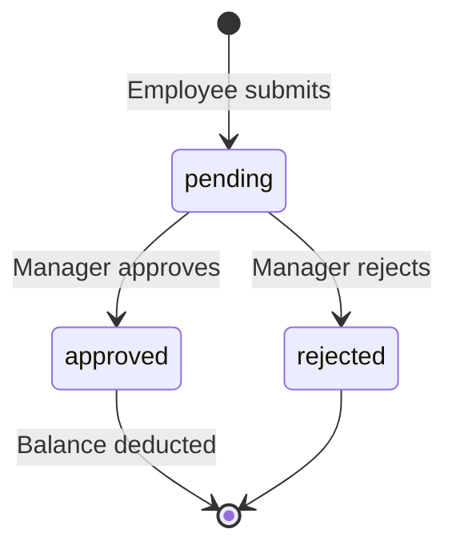

# Leave Management & Approvals

[← Back to showcase index](../../APP_SHOWCASE.md)

---

## The problem it solves

HR teams lose hours chasing paper forms, WhatsApp messages, and email threads. Managers approve leave without seeing team balances. Employees never know where their request stands.

**This module puts every leave request in one place — with a clear two-step approval chain and automatic balance updates.**

---

## What employees get

- Submit **vacation** (annual or casual), **sick leave**, **work from home**, **overtime**, or **business missions** from one dashboard
- See live **leave wallet** balances (annual, casual)
- Track every request with color-coded status badges
- Upload **medical documents** for sick leave
- Request **half-day** vacation (0.5 day deduction)

> 📸 **Screenshot placeholder**
>
> 
> *Capture: `/employee` — hero, leave wallet, quick actions*

> 📸 **Screenshot placeholder**
>
> 
> *Capture: Request leave modal with type selector*

---

## What managers get

- **Pending queue** — approve or reject team requests in one click
- Optional **inline edit** before approval (when permitted)
- View all team submissions by status
- Submit and track their own leave like any employee

> 📸 **Screenshot placeholder**
>
> 
> *Capture: `/manager` → Approve Team Forms*

---

## What HR / admins get

- Full **form pipeline**: pending → manager approved → HR approved / rejected
- Filter by **submission month** and **event month** (25th–25th pay period)
- **CSV export** and **print** for payroll handoff
- Manual balance adjustments when needed

> 📸 **Screenshot placeholder**
>
> 
> *Capture: `/admin` → Forms tab*

---

## How the approval cycle works

| Step | Who | Action |
|------|-----|--------|
| 1 | Employee | Fills form → status `pending` |
| 2 | Manager | Approves → `approved` (balance deducted) or rejects → `rejected` |
| 3 | Admin | Read-only tracking and exports (no HR approval step) |

---

## Smart rules built in

| Rule | Detail |
|------|--------|
| **Annual leave** | 15 days default; deducted on HR approval |
| **Casual leave** | 6 days default |
| **Sick leave** | Unlimited; medical doc optional |
| **Half-day** | 0.5 day; same start/end date required |
| **WFH** | Marketing department only |
| **Overtime** | Must match fingerprint punches (see [Attendance](./02-attendance.md)) |
| **Pay period** | Dates validated against 25th → 25th rolling window |

---

## Key files (for developers)

| Area | Path |
|------|------|
| Form schema | `models/Form.js` |
| API routes | `routes/forms.js` |
| Balance logic | `utils/vacationBalance.js`, `utils/vacationDays.js` |
| Submission UI | `hr-erp-frontend/src/components/FormSubmission.js` |
| Admin pipeline | `hr-erp-frontend/src/components/AdminDashboard.js` |

---

[Next: Attendance & Time Tracking →](./02-attendance.md)
