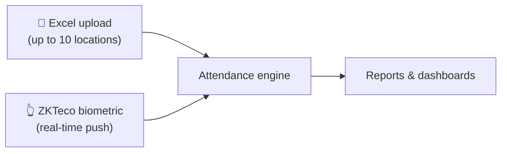

# Attendance & Time Tracking

[← Back to showcase index](../../APP_SHOWCASE.md) · [← Leave & Approvals](./01-leave-and-approvals.md)

---

## The problem it solves

Attendance lives in Excel exports from fingerprint machines, disconnected from approved leave. HR manually cross-checks who was late, who forgot to punch, and who claimed overtime without proof.

**This module unifies biometric data, spreadsheet imports, and approved leave — then calculates deductions and OT automatically.**

---

## Two ways data gets in

| Method | Best for | How |
|--------|----------|-----|
| **Excel upload** | Batch import from existing exports | Admin uploads XLS/XLSX on Attendance tab |
| **ZKTeco ADMS** | Live fingerprint devices | Devices push to `/iclock/cdata` — no manual upload |

---

## What admins see

- Upload attendance files and view **summary** or **detailed** reports
- **OT reconciliation** — fingerprint hours vs approved OT forms side by side
- **3-pillar deduction report** — missing punch, lateness, absence
- **Detailed leaves report** — balances + usage across the org
- **Fix punch** — correct clock-in/out when device errors occur

> 📸 **Screenshot placeholder**
>
> 
> *Capture: `/admin` → Attendance tab after upload*

> 📸 **Screenshot placeholder**
>
> 
> *Capture: Deduction report view*

> 📸 **Screenshot placeholder**
>
> 
> *Capture: OT reconciliation report*

---

## What employees see

- **Monthly snapshot** — their attendance at a glance
- **Personal OT report** — approved vs fingerprint overtime

> 📸 **Screenshot placeholder**
>
> *Add `./assets/employee-monthly-snapshot.png` when captured*

---

## What managers see

- **Team attendance** for their managed departments
- Drill into individual team member monthly detail

---

## The 3-pillar deduction model

Fair, transparent rules — no surprises on payday prep.

### Pillar A — Missing punch (progressive)

Forgot to clock in or out? Escalating monthly penalties:

| Occurrence | Result |
|------------|--------|
| 1st – 2nd | Warning |
| 3rd | 0.25 day |
| 4th | 0.5 day |
| 5th | 0.75 day |
| 6th+ | 1 full day |

### Pillar B — Lateness & early exit

- **15-minute daily grace** on combined late + early minutes
- Over grace → deduct `minutes ÷ 480` days (8-hour shift)

### Pillar C — Full absence

No punches and no approved leave/WFH/mission/sick form → **1 day** deduction.

### Automatic waivers

Approved vacation, sick leave, WFH, or mission forms **waive** deductions for covered dates — including half-day vacation.

---

## Overtime logic

Overtime requests are only valid when:

1. It's a **working day** (not weekend/holiday)
2. Employee has **both** clock-in and clock-out punches
3. Requested hours ≤ fingerprint-calculated OT
4. Manager can approve fewer hours than requested

---

## Key files (for developers)

| Area | Path |
|------|------|
| Attendance model | `models/Attendance.js` |
| Upload & reports API | `routes/attendance.js` |
| ZKTeco integration | `routes/zkteco.js`, `utils/zktecoParser.js` |
| Excel parser | `utils/attendanceParser.js` |
| Deduction engine | `utils/deductionCalculator.js` |
| OT logic | `utils/otReconciliation.js` |
| Holidays config | `config/attendanceHolidays.json` |

---

[← Leave & Approvals](./01-leave-and-approvals.md) · [Next: Recruitment (ATS) →](./03-recruitment-ats.md)
