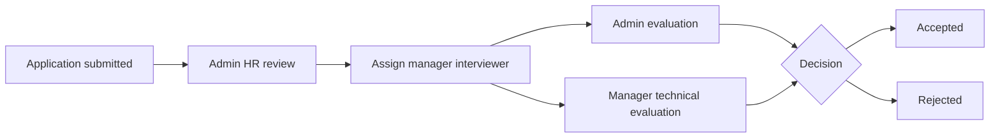

# Recruitment — Applicant Tracking System (ATS)

[← Back to showcase index](../../APP_SHOWCASE.md) · [← Attendance](./02-attendance.md)

---

## The problem it solves

CVs arrive by email, get lost in inboxes, and interview feedback lives in scattered notes. Hiring managers don't know who's assigned to evaluate whom.

**A public apply page, structured evaluations, and a single pipeline from application to hire/reject.**

---

## Public job application — no login required

Candidates visit **`/apply`** and complete a professional application:

- Resume upload with **PDF auto-fill** (name, email, phone, education, experience)
- Personal details, position, salary expectation, start date
- Multiple education and work history entries
- References
- Mobile-responsive, bilingual-ready layout

> 📸 **Screenshot placeholder**
>
> 
> *Capture: `/apply` in browser (logged out)*

### Built-in anti-spam

- 3 applications per IP per hour
- Duplicate email blocked within 30 days
- Resume: PDF/DOC/DOCX, max 5 MB

---

## Admin hiring dashboard

Full visibility from first application to final decision:

- **Live stats** — total, pending, under review, evaluated, accepted, rejected
- Search by name, email, or position
- Filter by status
- **Assign interviewer** (manager) to each candidate
- View/download resumes
- Submit **HR evaluation**

> 📸 **Screenshot placeholder**
>
> 
> *Capture: `/admin` → ATS tab*

---

## Manager technical evaluation

Managers see **only candidates assigned to them**:

- Full application details and resume
- Submit **technical evaluation**
- View all evaluations on a candidate

> 📸 **Screenshot placeholder**
>
> 
> *Capture: Evaluation modal with criteria ratings*

---

## Two-stage evaluation process

### Evaluation criteria (each rated)

| Criterion | Options |
|-----------|---------|
| Experience | Good fit / Fit / Not fit |
| Education | Good fit / Fit / Not fit |
| Communication | Good fit / Fit / Not fit |
| Presentable | Good fit / Fit / Not fit |
| Culture fit | Good fit / Fit / Not fit |
| **Overall** | Accepted / Pending / Rejected |

Every action is audit-logged: application submitted, interviewer assigned, evaluation submitted.

---

## Key files (for developers)

| Area | Path |
|------|------|
| Application model | `models/JobApplication.js` |
| Evaluation model | `models/Evaluation.js` |
| API | `routes/jobApplications.js` |
| CV parser | `utils/cvParser.js` |
| Public form UI | `hr-erp-frontend/src/components/ATS/JobApplicationForm.js` |
| Admin/manager UI | `hr-erp-frontend/src/components/ATS/ATSDashboard.js` |

---

[← Attendance](./02-attendance.md) · [Next: User Administration →](./04-user-administration.md)
