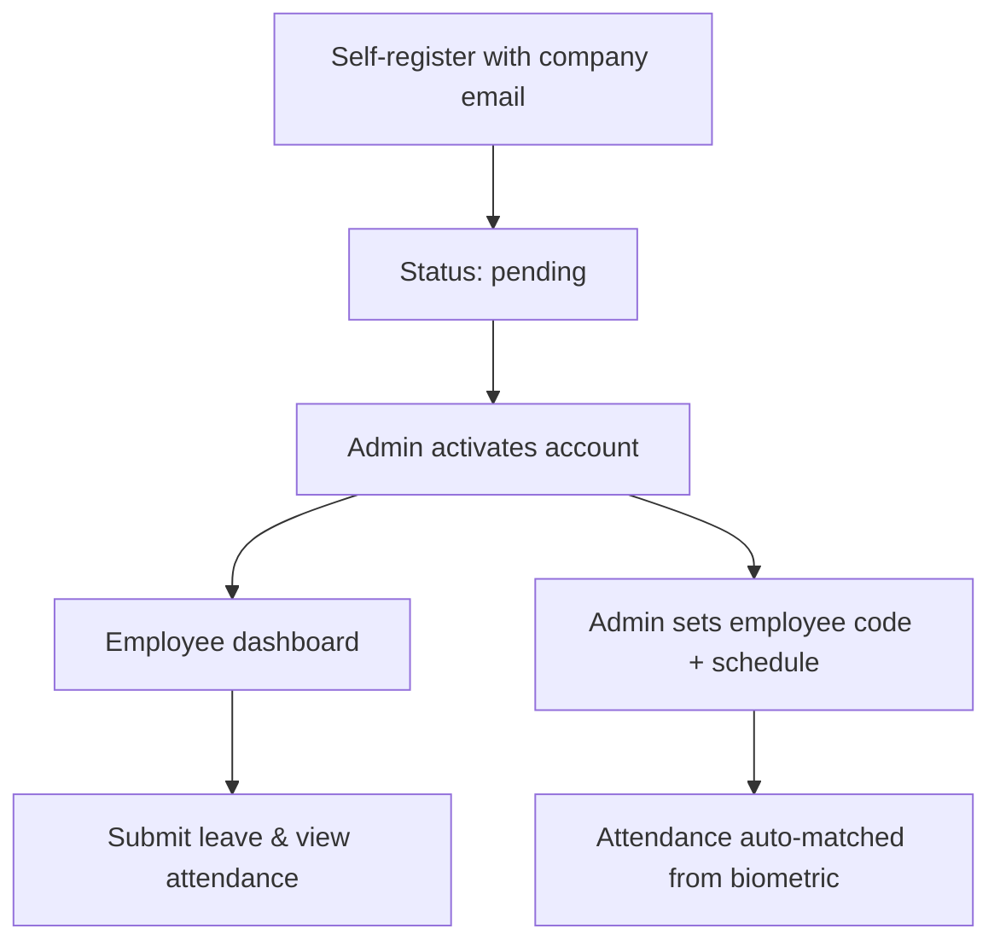

# User Administration & Employee Experience

[← Back to showcase index](../../APP_SHOWCASE.md) · [← Recruitment](./03-recruitment-ats.md)

---

## The problem it solves

Onboarding means creating accounts in one tool, tracking leave in another, and attendance in a third. Managers can't see their team without asking HR.

**One employee record powers login, leave balances, attendance matching, and manager scope.**

---

## Employee journey

### What every employee gets

- Personal dashboard with profile and avatar
- Leave wallet and request history
- Monthly attendance snapshot and OT report
- Visibility into manager **flags** (rewards or deductions noted on their record)

> 📸 **Screenshot placeholder**
>
> 
> *Capture: `/` login screen*

---

## Admin user management

- Create users with role, department, employee code, work schedule
- Activate, deactivate, or suspend accounts
- Adjust vacation balances manually
- **Bulk import** job titles and locations from Excel
- Employee insights summary on the overview tab

> 📸 **Screenshot placeholder**
>
> 
> *Capture: `/admin` → Users tab*

---

## Manager scope

Managers aren't limited to one department. Configure:

- **Managed departments** — explicit list
- **Department groups** — e.g. `Engineering_All` expands to all engineering sites at runtime

Optional permission: **`canEditDepartmentForms`** — edit team requests before approving.

---

## Employee flags

Managers and admins can note **deduction** or **reward** events on an employee:

- Visible to the employee on their dashboard
- Managers see team flags; admins see all
- Fully audit-logged

---

## Supported departments

Human Resources · Finance · Marketing · Sales · IT · Operations · Engineering (site-specific) · Customer Service · Legal · Community · Reception · Personal Assistant · Administration · Supply Chain · Site Service · Driver · Other

---

## Account statuses

| Status | Meaning |
|--------|---------|
| `pending` | Registered, awaiting activation |
| `active` | Full access |
| `inactive` / `suspended` | Login blocked |
| `draft` | Pre-provisioned by admin |

Registration requires `@newjerseyegypt.com` or `@gycegypt.com`.

---

## Key files (for developers)

| Area | Path |
|------|------|
| User model | `models/User.js` |
| User API | `routes/users.js` |
| Department groups | `config/departmentGroups.js` |
| Title/location import | `utils/userTitleLocationImport.js` |
| Employee flags | `routes/employee-flags.js`, `models/EmployeeFlag.js` |
| Dashboards | `EmployeeDashboard.js`, `ManagerDashboard.js`, `AdminDashboard.js` |

---

[← Recruitment](./03-recruitment-ats.md) · [Next: Reporting →](./05-reporting.md)
