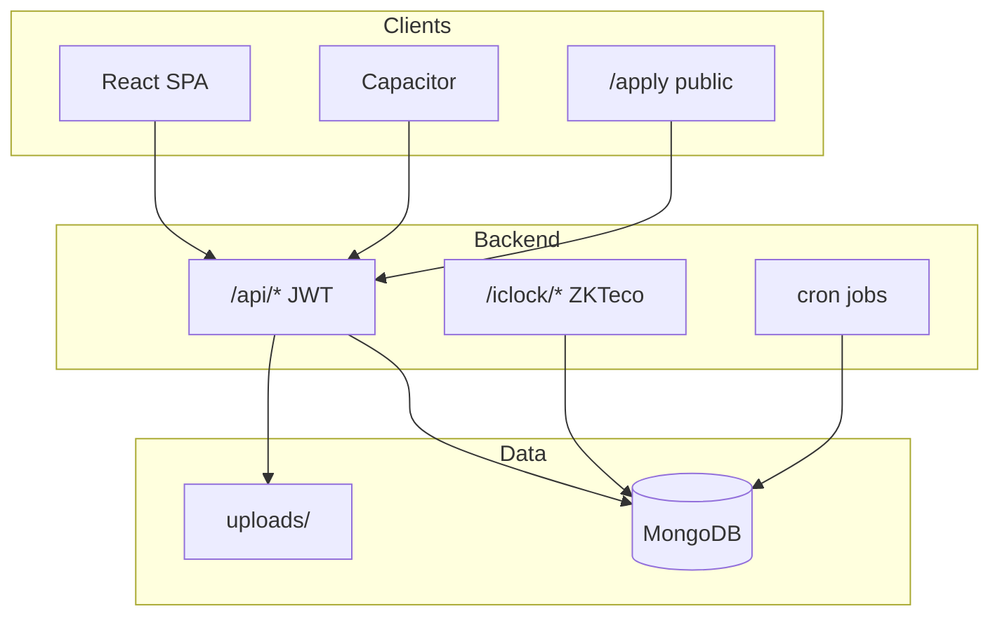

# Technical Reference

[← Back to showcase index](../../APP_SHOWCASE.md) · [← Roles & Security](./07-roles-and-security.md)

---

*For developers, integrators, and technical evaluators.*

---

## Architecture



### Repository layout

```
hrerp/
├── server.js                 # Express entry, middleware, cron
├── routes/                   # REST handlers
├── models/                   # Mongoose schemas (9 models)
├── utils/                    # Business logic (no services/ layer)
├── middleware/               # auth, validateObjectId, zktecoRawBody
├── config/                   # db, departmentGroups, holidays
├── hr-erp-frontend/          # React 18 + Capacitor
└── docs/showcase/            # This documentation set
```

### Runtime

| Environment | Backend | Frontend |
|-------------|---------|----------|
| Development | `:5001` | `:3000` |
| Production | Express serves React build | Same origin |

---

## Tech stack

| Layer | Technology |
|-------|------------|
| Backend | Node.js, Express 4 |
| Database | MongoDB, Mongoose 7 |
| Auth | JWT, bcryptjs |
| Frontend | React 18, React Router 6 |
| Mobile | Capacitor 6 |
| i18n | i18next |
| Email | Nodemailer |
| Files | multer, xlsx, pdf-parse |
| Ops | PM2, node-cron, Helmet, rate-limit |

---

## Data models

| Model | File | Purpose |
|-------|------|---------|
| User | `models/User.js` | Accounts, balances, schedules |
| Form | `models/Form.js` | Leave/OT/mission requests |
| Attendance | `models/Attendance.js` | Daily punch records |
| JobApplication | `models/JobApplication.js` | ATS applications |
| Evaluation | `models/Evaluation.js` | Interview scores |
| EmployeeFlag | `models/EmployeeFlag.js` | Deduction/reward notes |
| SystemSettings | `models/SystemSettings.js` | Singleton policy |
| Audit | `models/Audit.js` | Action log |
| Recruitment | `models/Recruitment.js` | Legacy ALS (not routed) |

---

## API overview

Base: `/api` · Auth header: `x-auth-token`

| Module | Prefix | Notes |
|--------|--------|-------|
| Health | `/health` | Public |
| Auth | `/auth` | register, login, me, reset-password |
| Users | `/users` | CRUD, avatar, import |
| Forms | `/forms` | CRUD, manager/admin approval |
| Attendance | `/attendance` | upload, reports, fix-punch |
| Job applications | `/job-applications` | public apply + ATS |
| Employee flags | `/employee-flags` | manager+ |
| Settings | `/settings` | read all, write super admin |
| Audit | `/audit` | super admin |
| Backup | `/backup` | super admin |
| ZKTeco | `/iclock` | no JWT |

Full endpoint list: see original tables in [`APP_SHOWCASE.md`](../../APP_SHOWCASE.md#api-surface) or grep `routes/`.

---

## Scheduled jobs

| Cron | Job |
|------|-----|
| `0 2 * * *` | Encrypted backup |
| `0 0 1 * *` | Monthly excuse quota reset (legacy field) |

---

## Frontend patterns

- **Lazy-loaded dashboards** — code splitting in `App.js`
- **`useApi` hook** — 5-minute GET cache, role-based preload
- **`ProtectedRoute`** — JWT + role path enforcement
- **Error boundaries** — graceful failure on dashboard load

---

## Deployment docs

| Doc | Topic |
|-----|-------|
| [`README-DEPLOYMENT.md`](../../README-DEPLOYMENT.md) | Production setup |
| [`DEPLOYMENT-GUIDE.md`](../../DEPLOYMENT-GUIDE.md) | Step-by-step deploy |
| [`BACKUP_SYSTEM.md`](../../BACKUP_SYSTEM.md) | Backup architecture |
| [`BIOMETRIC_ATTENDANCE_IMPLEMENTATION.md`](../../BIOMETRIC_ATTENDANCE_IMPLEMENTATION.md) | ZKTeco setup |
| [`EMAIL-SETUP.md`](../../EMAIL-SETUP.md) | Password reset email |

---

## Out of scope (by design)

- Payroll / payslips
- Benefits enrollment
- Performance reviews (beyond ATS)
- Excuse requests (removed from UI/API; legacy DB data may exist)

---

[← Roles & Security](./07-roles-and-security.md) · [↑ Back to showcase index](../../APP_SHOWCASE.md)
